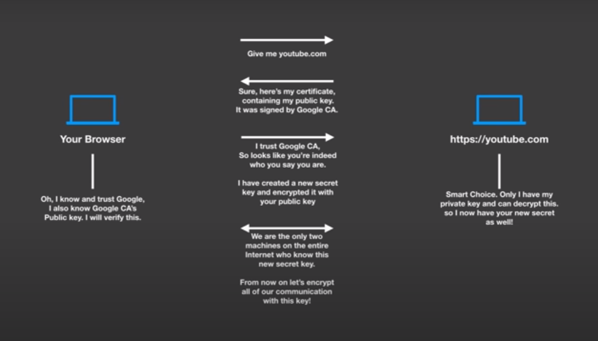
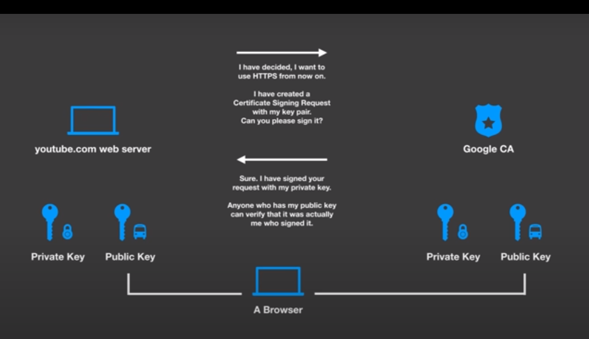

# SSL, TLS, HTTPS, Handshake everything..

In today's digital age, it's more important than ever to ensure that your online communications are secure. SSL, TLS, and HTTPS are all essential technologies for achieving this goal. In this blog, we'll explain what these terms mean and how they work together to keep your online data safe.

What is SSL?

SSL (Secure Sockets Layer) is a cryptographic protocol that provides secure communication over the internet. SSL is used to encrypt data between a client (such as a web browser) and a server (such as a web server). This means that any data transmitted between the two is protected from eavesdropping or tampering by third parties.

SSL works by establishing a secure connection between the client and server. This is done through a process called the SSL handshake, which involves the following steps:

The client sends a request to the server to initiate an SSL connection.
The server responds with a digital certificate, which includes the server's public key and other identifying information.
The client verifies the certificate to ensure that it was issued by a trusted authority and that it matches the server it is communicating with.
The client and server then negotiate a set of encryption algorithms and keys to use for the rest of the session.
Once the SSL handshake is complete, all data transmitted between the client and server is encrypted and protected from interception.

What is TLS?

TLS (Transport Layer Security) is a successor to SSL and provides the same security features. The primary difference between the two is that TLS is a more modern protocol that has addressed some of the vulnerabilities in SSL.

TLS works in a similar way to SSL, using a handshake to establish a secure connection between the client and server. However, TLS uses a different set of encryption algorithms and key sizes than SSL, making it more secure.

What is HTTPS?

HTTPS (Hypertext Transfer Protocol Secure) is a combination of HTTP and SSL/TLS. It is used to encrypt data transmitted between a client and server when browsing the web.

When you visit a website using HTTPS, your browser first establishes an SSL/TLS connection with the web server. This ensures that all data transmitted between your browser and the server is encrypted and secure.

Once the secure connection is established, your browser can then use HTTP to request and receive web pages, images, and other content from the server.

HTTPS is essential for securing online transactions, such as e-commerce transactions or online banking. It ensures that sensitive information, such as credit card numbers and login credentials, cannot be intercepted or tampered with by third parties.

In conclusion, SSL, TLS, and HTTPS are all critical technologies for securing online communications. By using encryption to protect data transmitted over the internet, they help ensure the privacy and security of online users. Whether you're browsing the web, sending emails, or making online transactions, these technologies play a crucial role in keeping your data safe.

https://www.whois.com/whois/

https://www.digicert.com/help/

Source : https://youtu.be/T4Df5_cojAs?list=LL

## Handshake

source : https://youtu.be/j9QmMEWmcfo?list=LL
