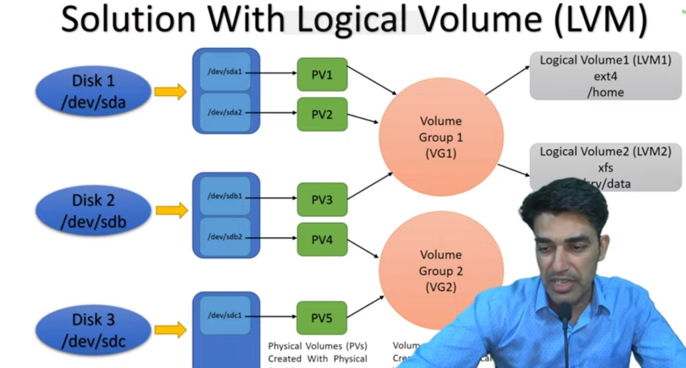

# Logical Volume (LVM) Feature

The goal of LVM is to facilitate managing the sometimes conflicting storage needs of multiple end users. Using the volume management approach, the administrator is not required to allocate all disk storage space at initial setup. Some can be held in reserve for later allocation



## Steps

1. Create a disk or connect physical disk
1. do partition of disk
1. create a PV from partitions
1. create volume group
1. create lv
1. file system for your LV
1. Mount

---

## after attaching Physical har drive create partitions

```bash
fdisk /dev/xvdf
```

```yaml


Welcome to fdisk (util-linux 2.37.2).
Changes will remain in memory only, until you decide to write them.
Be careful before using the write command.

Device does not contain a recognized partition table.
Created a new DOS disklabel with disk identifier 0x9acca856.

Command (m for help): n
Partition type
   p   primary (0 primary, 0 extended, 4 free)
   e   extended (container for logical partitions)
Select (default p): p
Partition number (1-4, default 1):
First sector (2048-209715199, default 2048):
Last sector, +/-sectors or +/-size{K,M,G,T,P} (2048-209715199, default 209715199): +35G

Created a new partition 1 of type 'Linux' and of size 35 GiB.

Command (m for help): t
Selected partition 1
Hex code or alias (type L to list all): 8e
Changed type of partition 'Linux' to 'Linux LVM'.

Command (m for help): n
Partition type
   p   primary (1 primary, 0 extended, 3 free)
   e   extended (container for logical partitions)
Select (default p):

Using default response p.
Partition number (2-4, default 2):
First sector (73402368-209715199, default 73402368):
Last sector, +/-sectors or +/-size{K,M,G,T,P} (73402368-209715199, default 209715199):

Created a new partition 2 of type 'Linux' and of size 65 GiB.

Command (m for help): t
Partition number (1,2, default 2):
Hex code or alias (type L to list all): 8e

Changed type of partition 'Linux' to 'Linux LVM'.

Command (m for help): w
The partition table has been altered.
Calling ioctl() to re-read partition table.
Syncing disks.

```

Now lsblk output will look like this

```yaml
NAME     MAJ:MIN RM  SIZE RO TYPE MOUNTPOINTS
loop0      7:0    0 24.4M  1 loop /snap/amazon-ssm-agent/6312
loop1      7:1    0 55.6M  1 loop /snap/core18/2632
loop2      7:2    0 63.2M  1 loop /snap/core20/1695
loop3      7:3    0  103M  1 loop /snap/lxd/23541
loop4      7:4    0 49.6M  1 loop /snap/snapd/17883
xvda     202:0    0    8G  0 disk
├─xvda1  202:1    0  7.9G  0 part /
├─xvda14 202:14   0    4M  0 part
└─xvda15 202:15   0  106M  0 part /boot/efi
xvdf     202:80   0  100G  0 disk
├─xvdf1  202:81   0   35G  0 part
└─xvdf2  202:82   0   65G  0 part
xvdg     202:96   0  100G  0 disk
```

Now lets see how many pvs we have already

```bash
pvs
```

## Now lets create pv out of one partition we created earlier in disk

```bash
pvcreate /dev/xvdf1
# output
  Physical volume "/dev/xvdf1" successfully created.
```

Now you can see you will hav enew pv run

```bash
pvs
```

OUTPUT

```yaml
PV         VG Fmt  Attr PSize  PFree
/dev/xvdf1    lvm2 ---  35.00g 35.00g
```

## volume group

```bash
# here you can use multiple partition as you want
vgcreate anyname /dev/xvdf1 /dev/xvdf2
#actual command in demo
vgcreate LinuxVG /dev/xvdf1
```

OUTPUT

```yaml
Volume group "LinuxVG" successfully created
```

Now see newly created vgs

```bash
vgs
#vgdisplay comand for detail overview
```

OUTPUT

```ymal
  VG      #PV #LV #SN Attr   VSize   VFree
  LinuxVG   1   0   0 wz--n- <35.00g <35.00g

```

# lvcreate

```bash
lvcreate -L 3G -n LinuxLV   LinuxVG
#         size   name of lv nameof  group
#actual demo command
lvcreate -L 10G -n LinuxLV LinuxVG
```

to see newly creted LV

```bash
lvs
# for detail overview
lvdisplay
```

Your lsblk will look like this now

```yaml
NAME                MAJ:MIN RM  SIZE RO TYPE MOUNTPOINTS
loop0                 7:0    0 24.4M  1 loop /snap/amazon-ssm-agent/6312
loop1                 7:1    0 55.6M  1 loop /snap/core18/2632
loop2                 7:2    0 63.2M  1 loop /snap/core20/1695
loop3                 7:3    0  103M  1 loop /snap/lxd/23541
loop4                 7:4    0 49.6M  1 loop /snap/snapd/17883
xvda                202:0    0    8G  0 disk
├─xvda1             202:1    0  7.9G  0 part /
├─xvda14            202:14   0    4M  0 part
└─xvda15            202:15   0  106M  0 part /boot/efi
xvdf                202:80   0  100G  0 disk
├─xvdf1             202:81   0   35G  0 part
│ └─LinuxVG-LinuxLV 253:0    0   10G  0 lvm
└─xvdf2             202:82   0   65G  0 part
xvdg                202:96   0  100G  0 disk
```

now your new LV is ready but it will not mount to any directory until you provide filesystem to your LV

## file system to your LV

```bash
mkfs.ext4 /dev/LinuxVG/LinuxLV
```

OUTPUT

```yaml
Creating filesystem with 2621440 4k blocks and 655360 inodes
Filesystem UUID: 2a81ce96-6719-4833-84cd-c948e1c29554
Superblock backups stored on blocks:
	32768, 98304, 163840, 229376, 294912, 819200, 884736, 1605632

Allocating group tables: done
Writing inode tables: done
Creating journal (16384 blocks): done
Writing superblocks and filesystem accounting information: done

```

## finally mount

```bash
 mount /dev/LinuxVG/LinuxLV /data
```

```bash
lsblk -f
```

```yaml
NAME                MAJ:MIN RM  SIZE RO TYPE MOUNTPOINTS
loop0                 7:0    0 24.4M  1 loop /snap/amazon-ssm-agent/6312
loop1                 7:1    0 55.6M  1 loop /snap/core18/2632
loop2                 7:2    0 63.2M  1 loop /snap/core20/1695
loop3                 7:3    0  103M  1 loop /snap/lxd/23541
loop4                 7:4    0 49.6M  1 loop /snap/snapd/17883
xvda                202:0    0    8G  0 disk
├─xvda1             202:1    0  7.9G  0 part /
├─xvda14            202:14   0    4M  0 part
└─xvda15            202:15   0  106M  0 part /boot/efi
xvdf                202:80   0  100G  0 disk
├─xvdf1             202:81   0   35G  0 part
│ └─LinuxVG-LinuxLV 253:0    0   10G  0 lvm  /data
└─xvdf2             202:82   0   65G  0 part
xvdg                202:96   0  100G  0 disk
root@ip-172-31-92-157:~# lsblk -f
NAME                FSTYPE      FSVER    LABEL           UUID                                   FSAVAIL FSUSE% MOUNTPOINTS
loop0               squashfs    4.0                                                                   0   100% /snap/amazon-ssm-agent/6312
loop1               squashfs    4.0                                                                   0   100% /snap/core18/2632
loop2               squashfs    4.0                                                                   0   100% /snap/core20/1695
loop3               squashfs    4.0                                                                   0   100% /snap/lxd/23541
loop4               squashfs    4.0                                                                   0   100% /snap/snapd/17883
xvda
├─xvda1             ext4        1.0      cloudimg-rootfs 687fab62-1ba5-4282-890e-9266064f7d27        6G    20% /
├─xvda14
└─xvda15            vfat        FAT32    UEFI            B2B4-82AC                                99.1M     5% /boot/efi
xvdf
├─xvdf1             LVM2_member LVM2 001                 vo5baT-ZF7x-mLeL-De3X-T6GX-UDpT-oXgJ9g
│ └─LinuxVG-LinuxLV ext4        1.0                      2a81ce96-6719-4833-84cd-c948e1c29554      9.2G     0% /data
└─xvdf2
xvdg
```

---

Here we have done with lv but if you want to see awesome advantage of lv then lets go for

## clean up (how to remove )

Basically we will go from right

```bash
lvremove /dev/linuxVG/LinuxLV
vgremove LinuxVG
pvremove /dev/xvdf1
# dlete the partitions too
```

---

# Resize LVM in Linux

```bash
#crete partion if not avaiable in disk
# create pv out of it pvcreate /dev/xvdf2
# we extend VG from /dev/xvdf2
vgextends VG /dev/xvdf2
lvextend -L +2G /dev/linuxVG/linuxLV
resize2fs /dev/VG/LV  2G
```

## reduce LV

```bash
# -l 2G after reduce
lvreduce  -L 2G -n /dev/LinuxVG/LinuxLV
```
