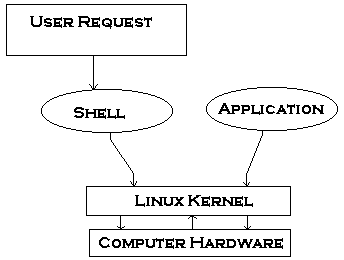

# What Is Linux

Linux is a free open-source operating system based on Unix. Linus Torvalds originally created Linux with the assistance of developers from around the world. Linux is:

Free
Unix Like
Open Source
Network operating system

# What is Linux?

Strictly speaking, Linux is a kernel. A kernel provides access to the computer hardware and control access to resources such as:

- Files and data.
- Running programs.
- Loading programs into memory.
- Networks.
- Security and firewall.
- Other resources etc.

# Linux operating system

The kernel decides who will use a resource, for how long and when.You can download the Linux kernel from the official web site. However, the Linux kernel itself is useless unless you get all the applications such as text editors, email clients, browsers, office applications, etc. Therefore, someone came up with idea of a Linux distribution. A typical Linux distribution includes:

- Linux kernel.
- GNU application utilities such as text editors, browsers etc.
- Collection of various GUI (X windows) applications and utilities.
- Office application software.
- Software development tools and compilers.
- Thousands of ready to use application software packages.
- Linux Installation programs/scripts.
- Linux post installation management tools daily work such as adding users, installing applications, etc.
  And, a Shell to glue everything together.
  Corporate and small businesses users need support while running Linux, so companies such as Red Hat or SUSE or Canonical (maker of Ubuntu) provide Linux tech-support and sell it as product. Nevertheless, community driven Linux distributions do exist such as Debian, Gentoo and they are entirely free. There are over 1000+ Linux distributions.

# Linux and open source

The Linux operating system (distro) is an open-source, freely available OS. One can install Linux on:

- Desktop computer
- Laptop computer
- Bare metal servers
- Cloud servers
- Smartphones
- Tablets
- Supercomputers
- Video game devices (console)
- In-car entertainment systems
- In-flight entertainment systems
- Medical devices
- Mars Rover

# Linux is everywhere

Initially, Linux was created for PC. Now it has been ported to many devices due to open-source code. For example, Android OS is based upon a modified Linux kernel version.

# What does Linux OS/distro include?

A typically Linux distro such as Ubuntu/Debian or Fedora Linux and other includes:

- Linux kernel
- Text based applications (e.g., vim)
- GUI based applications (e.g., Firefox)
  Compilers and programming languages (e.g., C/C++ or PHP/Perl/Python)
- Server applications (e.g., MySQL/MariaDB or Apache)
- And much more.

# Why was the Linux kernel created?

In 1991, Linus Torvalds was studying UNIX at university, where he was using a special educational, experimental purpose operating system called Minix (a small version of UNIX to be utilized in the academic environment). However, Minix had its limitations, and Linus felt he could create something better. Therefore he developed his version of Minix, known as Linux. Linux was Open Source right from the start.

Linux is a kernel developed by Linus. The kernel was bundled with system utilities and libraries from the GNU project to create a usable operating system. Sometimes people refer to Linux as GNU/Linux because it has system utilities and libraries from the GNU project. Linus Torvalds is credited for creating the Linux Kernel, not the entire Linux operating system

**Linux distribution == Linux kernel + GNU system utilities and libraries + Installation scripts + Management utilities and more.**

Please note that Linux is now packaged for different uses in Linux distributions, which contain the sometimes modified kernel along with a variety of other software packages tailored to different requirements such as:

- Server
- Desktop
- Workstation
- Routers
- Various embedded devices
- Mobile phones

# Typical steps to install Linux

- Download Linux ISO CD or DVD
- Burn that CD/DVD to your USB pen drive or DVD
- Back up all existing data. Do not skip this step.
- Some Linux distributions allows dual-booting by resizing existing Windows partition too.
- Then, restart the computer.
- Go to BIOS settings and enable boot from USB or DVD drive
- Insert the USB pen or DVD
- Then start booting from the USB pen/DVD
- Linux installer will popup on the screen
- You need to follow onscreen instructions

# Prominent Linux users

The Linux operating system runs all top 500 of the world's fastest supercomputers

- NASA uses Linux.
- Linux is the only operating system that runs on Mars, thanks to NASA's Perseverance Rover.
- Automotive Grade Linux puts Linux in various cars made by - Mercedes Benz, Subaru, Toyota and others
- Both CERN and Fermilab use Linux in all their work.
- eCommerce giant Amazon, uses Linux "in nearly every corner of its business".
- Search giant Google uses a version of Ubuntu and Debian internally.



The kernel is the heart of the Linux operating system. It manages the resources of Linux such as:

- File management
- Multitasking
- Memory management
- I/O management
- Process management
- Device management
- Networking support including IPv4 and IPv6
- Advanced features such as virtual memory, shared libraries, demand loading, shared copy-on-write executables etc

The kernel decides who will use these resources and for how long and when. It runs your programs or sets up to execute binary files. The kernel acts as an intermediary between the computer hardware and various applications.

Computers understand the language of zeros and ones known as binary language. In the early days of computing, instructions were provided using binary language, which is difficult for all of us to read and write. Therefore, in an operating system there is a special program called the shell. The shell accepts human readable commands and translates them into something the kernel can read and process.

# What Is a Shell?

- The shell is a user program or it is an environment provided for user interaction.
- It is a command language interpreter that executes commands read from the standard input device such as keyboard or from a file.
- The shell gets started when you log in or open a console (terminal).
  Quick and dirty way to execute utilities.
  The shell is not part of system kernel, but uses the system kernel to execute programs, create files etc.
- Several shells are available for Linux including:
  - BASH ( Bourne-Again SHell ) - Most common shell in Linux. It's Open Source.
  - CSH (C SHell) - The C shell's syntax and usage are very similar to the C programming language.
  - KSH (Korn SHell) - Created by David Korn at AT & T Bell Labs. The Korn Shell also was the base for the POSIX Shell standard specifications.
  - TCSH - It is an enhanced but completely compatible version of the Berkeley UNIX C shell (CSH).

Please note that each shell does the same job, but each understands different command syntax and provides different built-in functions. Under MS-DOS, the shell name is COMMAND.COM which is also used for the same purpose, but it is by far not as powerful as our Linux Shells are!

# Shell Prompt

There are various ways to get shell access:

- Terminal - Linux desktop provide a GUI based login system. Once logged in you can gain access to a shell by running X Terminal (XTerm), Gnome Terminal (GTerm), or KDE Terminal (KTerm) application.
- Connect via secure shell (SSH) - You will get a shell prompt as soon as you log in into remote server or workstation.
- Use the console - A few Linux system also provides a text-based login system. Generally you get a shell prompt as soon as you log in to the system.

# How do I find out my current shell name?

To find all of the available shells in your system, type the following command:

```bash
cat /etc/shells
```

## Getting help in shell

```bash
man commandName
info commandName
commandName -h
commandName --help
```

# What is a Shell Script or shell scripting

Normally shells are interactive. It means the shell will accept command from you (via keyboard) and execute them. However, if you store a sequence of commands to a text file and tell the shell to execute the text file instead of entering the commands, that is known as a shell program or shell script.

A Shell script can be defined as - "a series of command(s) stored in a plain text file". A shell script is similar to a batch file in MS-DOS, but it is much more powerful compared to a batch file.

Shell scripts are a fundamental part of the UNIX and Linux programming environment.

# Each shell script consists of

- Shell keywords such as if..else, do..while.
- Shell commands such as pwd, test, echo, continue, type.
- Linux binary commands such as w, who, free etc..
- Text processing utilities such as grep, awk, cut.
- Functions - add frequent actions together via functions. For example, /etc/init.d/functions file contains functions to be used by most or all system shell scripts in the /etc/init.d directory.
- Control flow statments such as if..then..else or shell loops to perform repeated actions.

## Each script has purpose

- Specific purpose - For example, backup file system and database to NAS server.
- Act like a command - Each shell script is executed like any other command under Linux.
- Script code usability - Shell scripts can be extended from existing scripts. Also, you can use functions files to package frequently used tasks.

## Did you know?

- It is the shell that lets you run different commands without having to type the full pathname to them even when they do not exist in the current directory.
- It is the shell that expands wildcard characters, such as \* or ?, thus saving you laborious typing.
- It is the shell that gives you the ability to run previously run commands without having to type the full command again by pressing the up arrow, or pulling up a complete list with the history command.
- It is the shell that does input, output and error redirection..

# Practical examples where shell scripting actively used

Monitoring your Linux system.
Data backup and creating snapshots.
Dumping Oracle or MySQL database for backup.
Creating email based alert system.
Find out what processes are eating up your system resources.
Find out available and free memory.
Find out all logged in users and what they are doing.
Find out if all necessary network services are running or not. For example if web server failed then send an alert to system administrator via a pager or an email.
Find out all failed login attempt, if login attempt are continue repeatedly from same network IP automatically block all those IPs accessing your network/service via firewall.
User administration as per your own security policies.
Find out information about local or remote servers.
Configure server such as BIND (DNS server) to add zone entries.
Shell scripting is fun. It is useful to create nice (perhaps ugly) things in shell scripting. Here are a few examples of scripts I use everyday:

Find out today's weather (useful when you are busy in a chat room).
Find out what that site is running (just like netcraft).
Download RSS feeds and display them as you login or in your email.
Find out the name of the MP3 file you are listening to.
Monitor your domain expiry date every day.
