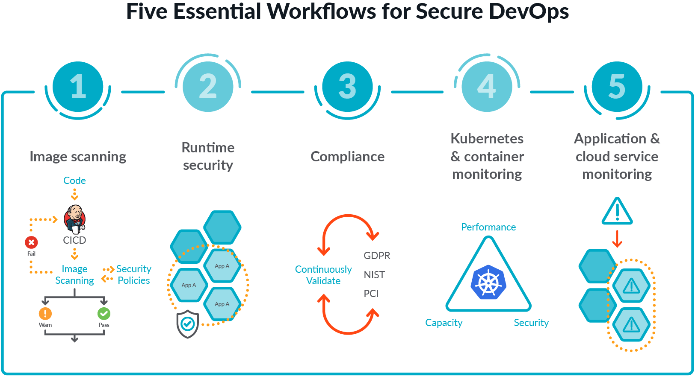

# Security in Microservices

## First Secure Dockerfile

we will first look how we can make container secures

1. Never user latest in Dockerfile for base image (use specific version)

```bash
FROM ubuntu:18.04 # Any supported Tag but dont use latest
```

1. Use AND operator in RUN commands if you have multiple run commands (Not security issue). This only optimized layers

```bash
RUN apt update -y && apt install docker.io && apt install docker-compose
```

1. Never put password as an ENV variable in Dockerfile

1. use custom user if not needed root privilages

If env variable is neccessary for application then pass it on when you run your container

```bash
docker run my-image -e PASSWORD=secret
```

Now it is still not secure if you are running on CI tool, incase of jenkins you can user env variable as secret on configuration

1. using entrypoint and cmd instruction in the executable format

1. when we run a user by default it run as a root (which is not recomended)

switch root and newly created user if you required to install package which required root permissions

1. use official base of application insread of OS(alpine or ubunutu)

```bash
from ubuntu
run apt install nodejs
```

recomendeation

```bash
from nodejs
```

1. use small image (for example node:alpine is a example)

1. Use multi stage builds for reducing images size
   example we need npm for building but not serving we can serve from nginx

1. Order Dockerfile commands from least to most frequently changing

````bash
least change
  |
  |
  |
Most frequent change
```
1. Use Dockerignore file in order to reduce image size and if you can get those file by installing package

e.g dont copy node_modules folder in image because you can download it from npm install inside a container


1. use docker scan for scanning images for valunrabilities

---

kube-bench test k8s cluster to ensure that its meet CIS guidelines for security

https://github.com/aquasecurity/kube-bench/releases/download/v0.6.10/kube-bench_0.6.10_linux_amd64.deb
curl -L https://github.com/aquasecurity/kube-bench/releases/download/v0.6.10/kube-bench_0.6.10_linux_amd64.deb
-o kube-bench_0.6.10_linux_amd64.deb

sudo su

apt install ./kube-bench_0.6.10_linux_amd64.deb -f

kube-bench

it will do CIS analysis acording to machine they are executing differenet analysic for master and
worker node
Starting Fixing now 1 by one
ps -ef | grep etcd

point
kubelet run as configuration if you bootsraped using kubeadm

# Now after setup secure cluster we need to configure k8s manifest correctly

Stop chasing misconfigurations, automate policy enforcement from code to cloud.

For this we will use

https://www.datree.io/

### why we even need this ?

simple answer would be that we want to avoid miscofiguration in manifests.
for example if we are using argocd and we forgot to add annotation in configmap argocd will behave differntly

# Setup Ingress Controller

Please note that setting up ingress is different from environment to environment
I am using minikube for this demonstration
To enable the NGINX Ingress controller, run the following command:

```bash
minikube addons enable ingress
````

Verify that the NGINX Ingress controller is running

kubectl get pods -n ingress-nginx

kubectl create deployment web --image=gcr.io/google-samples/hello-app:1.0

kubectl expose deployment web --type=NodePort --port=8080
kubectl get service web
minikube service web --url

### Create example-ingress.yaml from the following file:

```yaml
apiVersion: networking.k8s.io/v1

kind: Ingress

metadata:
  name: example-ingress

  annotations:
    nginx.ingress.kubernetes.io/rewrite-target: /$1

spec:
  rules:
    - host: hello-world.info

      http:
        paths:
          - path: /

            pathType: Prefix

            backend:
              service:
                name: web

                port:
                  number: 8080
```

kubectl apply -f example-ingress.yaml

kubectl get ingress

```bash
NAME              CLASS   HOSTS        ADDRESS          PORTS     AGE
example-ingress   nginx   usama.info   192.168.59.102   80, 443   44m
```

Add the following line to the bottom of the /etc/hosts file on your computer (you will need administrator access):
ip-aadress-from-above-command usama.info
k expose po caddy --name caddy-svc --port 80

kubectl port-forward service/caddy-svc 7080:80

In hosts file
minikube ip learnwithusama.com

openssl req -x509 -newkey rsa:4096 -sha256 -nodes -keyout tls.key -out tls.cert -subj '/CN=learnwithusama.com' -days 365

### Now TLS in that domain usama.info

openssl req -x509 -newkey rsa:4096 -sha256 -nodes -keyout tls.key -out tls.cert -subj '/CN=usama.info' -days 365

k create secret tls sec-usama.info --cert=tls.cert --key=tls.key
make some change in example-ingress.yaml file under spec block

```yaml
tls:
  - hosts:
      - usama.info
    secretName: sec-usama.info
```

Now you have apply change
k apply -f example-ingress.nginx

## k8s security Network Policies

Authentication -> Autherization -> Admission control -> stored in etcd

1. When we create a network policy we must have to provide a label for selection of pod where the
   policy will apply
   1f policy is like list then its and OR(condition), otherwise AND(condition)
   example of OR condition

```yaml
- ipBlock:
    cidr: 172.17.0.0/16
    except:
      - 172.17.1.0/24
- namespaceSelector:
    matchLabels:
      project: myproject
- podSelector:
    matchLabels:
      role: frontend
```

### Best Practise

Deny All traffice between the pods, by default k8s allow communication between all pods

```yaml
apiVersion: networking.k8s.io/v1
kind: NetworkPolicy
metadata:
  name: default-deny-ingress
  namespace: default
spec:
  podSelector: {}
  # Which mean  all pods (match all pods) bcz we have not defined any thing here
  policyTypes:
    - Ingress
```

Refers to k8s documentation for making network policy of your Application Requirements
Tips
Protect node metadata and endpoints
control control-plane and worker node ports using network policy

# Minimize use of Access GUI

For access k8s dashboard we have two ways using kubeconfig(file) or Token(Bearer token)
k config view
k config current-context

we will not give acces to everyone
we will to Authorization using RBAC

how it will works , we will create a user , and role with get,list and create rbac with both
service account -> Cluster role --> Restrict to view,get ,list etc

--- cl us t er role bi nid ing----

# Verify binaries before deploy

# Random

when we create a ns default service account, secret is autmatically get created (not sure in new version of k8s)
when we create a pod default service account get mapped, also secret got mounted
we need to avoid that by set automountServiceAccount to false on creating a namespace
if you fortunatley get access to container you can see the token by

```bash
cat /var/run/secrets/kubernetes.io/serviceaccounts/token
```

# Minimize Host OS footprint (Reduce Attack surface)

1. Update Hosts regularly
1. Removed unwanted utilities( or Network configuretion)
1. Limit access with firewalls
1. Logs all system activities

In general how Applications works in OS

From user space(where use application installed) ----> Sys calls ---> kernal space(they talk to hardware)

example
Slack ---> Sys calls ---> kernal space

### Reduce Host OS attack surface

1. Create Pod to use host namespace only if necessary

   - Dont use hostIPC:true unless if necessary
   - Dont use hostNetwork: true unless if necessary
   - Dont use hostPID: true unless if necassry
     by default all these false

1. Don't run containers in priviliged mode
1. Limit node access to users
1. Remove Unnecessary binaries and service

   for list all running services

   ```bash
   systemctl list-units --type service
   ```

1. ## control across using SSH , disable root and password based login

   use jump host to ssh in to any worker node

   view auth keys
   cat /home/usama/.ssh/authorized_keys

   Disable password authentication

   sshd_config

   permitRootLogin no
   PasswordAuthentication no

1. Adding correct firewalls rule to restrict host access on open ports
1. Prevent containers from loading unwanted kernal modules
1. Identify and address open ports

- ```bash
  #check service listening
  netstat -talnp
  netstat -talnp | grep -i 9090 | grep -w -i listen
  ```

- ```bash
  #check for service to port mapping
  cat /etc/services | grep -i httpd
  ```

1. Restrict Allowed Host path using PodSecurityPolicies

### Limit Node access to users

# Restrict Container Access with AppArmor

steps
install apparmor -> create profile -> enforced/load apparmor profile -> apply profile to pod
container and system are secure now

# Open Policy Agent

steps
install gatekeeper -> create constraint template(rego) -> create constrint (CRD)-> create deploy & test

# Security Context for a Pod or Container

when we create a pod or anything it take securityContext with themselves to talk to kernal

# Manage K8s Secrets and secret types

whenever we create a pod it take default service account whenever any pod need to communicate to API server it will take secret (jwt token) of the default service account that was attached
Topic secret as volume in container mounting
secret as env in containers

# Container Runtime Sandboxes gVisor runsc/kata containers

now pods cant directly communicate to host for security reason
userspace --> Visor runsc/kata --- > Host OS

steps
install on evry machine

1. Install gvisor/kata
1. create runtimeclass
1. attach runtimeclass to pod

important :

```bash
k exec -it pod -- dmesg (it will tell about OS)
```

# Implement pod to pod encryption by use of mTLS with Service Mesh

TLS is succesor of SSL (previous name) . no differnt in SSL and TLS

TLS is a cryptographical protocl to establish a secure connection btw two ststems

1. TLS provide authenticity
1. Confidentiality
1. Integrity

Also know as CIA
so CIA is provided by TLS protocol

<!-- How TLS works -->

mTLS matual TLS (with one extra condition or rule ) that client also to be authenticated

lets learn Istio
istio is a service mesh
okay but what is service mesh then ?

sevice mesh manages communication between microservices

why do we even need one another tool ?

Managing microservices application(logging , file system communucation) is a nightmare is microservice architecture

# Minimize base image footprint

## Cloud Native 4C's

**Cloud/Corporate , Cluster , Container , Code**

- Use small image like alpine we have already seen in best practise of Dockerfile
- use multi stage buld
- use google distroless images (better for production)

Three type of images for a application

1. FULL
1. SLIM
1. ALPINE
1. DISTROLESS

use fromlatest.io website for validating your dockerfile

# Whitelist allowed Registries using ImagePolicyWebhook & OPA Gatekeeper

Docker config level whitelist/blocklist
Edit /etc/sysconfig/docker

```bash
block or add regitry in these file use google plz
```

you can also change in containerd
Edit /etc/sysconfig/docker

another approach is imagePolicyWebhook to whitelist specific
registory
for upderstanding imagePolicyWebhook we will need to understand how admission controler works

another approach is OPA gatekeeper to enforce specfic registry

# Scan images for known vulnerabilities Trivy

<!--
  <a aria-label="Vercel logo" href="https://vercel.com">
    
  </a>

 <h1 align="center">Next.js</h1> -->

### Five Esential Workflow for secure DevOps

  

check out this amazing website https://sysdig.com/blog/image-scanning-best-practices/

https://sysdig.com/

# Scan images for known vulnerabilities Trivy Anchore CLI

we can also enable image scanning on push in Cloud Service Provider
AWS use anchor CLI (not 100% sure)

# K8s Best Practices

## Concepts and Definations

**Kubernetes admission controllers** are a powerful Kubernetes-native feature that helps you define and customize what is allowed to run on your cluster. An admission controller intercepts and processes requests to the Kubernetes API after the request is authenticated and authorized, but prior to the persistence of the object.
