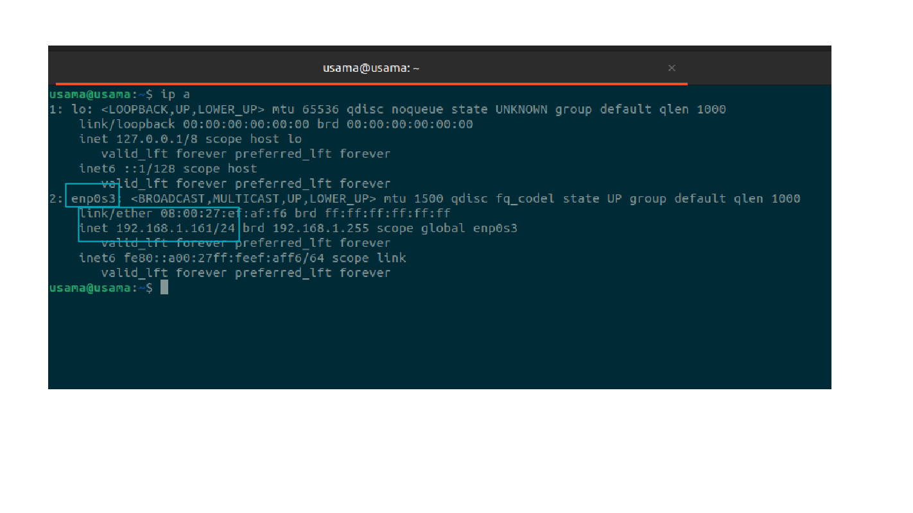

# Network Management in Linux

IPv4 and IPv6 are different versions of the Internet Protocol (IP), the protocol that is used to route traffic on the internet.

IPv4 is the fourth version of the IP protocol and is the most widely used version today. It uses 32-bit addresses and can support up to 4.3 billion unique addresses. IPv4 addresses are typically written in dotted decimal notation, such as 192.168.0.1.

IPv6 is the sixth version of the IP protocol and was designed to address the shortage of IPv4 addresses. It uses 128-bit addresses and can support up to 3.4 x 10^38 unique addresses. IPv6 addresses are typically written in hexadecimal notation, such as 2001:0db8:85a3:0000:0000:8a2e:0370:7334.

One of the main differences between IPv4 and IPv6 is the size of the address space. IPv6 has a much larger address space than IPv4, which means that it can support a much larger number of devices on the internet. IPv6 also has several other improvements over IPv4, including support for enhanced security, better support for mobile devices, and improved support for multicast traffic.

In summary, IPv4 and IPv6 are different versions of the IP protocol that are used to route traffic on the internet. IPv4 is the most widely used version today, but IPv6 is increasingly being adopted as the shortage of IPv4 addresses becomes more acute.

# To assign a static IP address to a network interface in Ubuntu using the nmtui command-line tool, you can follow these steps:

Open the nmtui tool by typing the following command into a terminal window:

```bash
sudo nmtui
```

From the main menu, select the Edit a connection option and press Enter.

In the list of connections, select the interface that you want to configure and press Enter.

In the Edit Connection screen, select the IPv4 tab.

From the Method drop-down menu, select the Manual option.

In the Addresses field, enter the static IP address that you want to assign to the interface. For example: 192.168.0.100/24.

In the Gateway field, enter the IP address of the default gateway for the network.

Press OK to save the changes.

Select the Activate a connection option from the main menu and press Enter.

In the list of connections, select the interface that you just configured and press Enter to activate it.

Close the nmtui tool by pressing Esc or q.

To make the changes persistent across reboots, you will need to edit the network configuration file for the interface. The file is usually located at /etc/netplan/XX-YY-interface.yaml, where XX-YY is the name of the interface.

For example, if you are configuring the ens3 interface, the configuration file would be /etc/netplan/50-cloud-init.yaml. Open the file in a text editor and add the following lines:

```bash
network:
  version: 2
  ethernets:
    ens3:
      addresses: [192.168.0.100/24]
      gateway4: 192.168.0.1
```

Save the file and apply the changes by running the following command:

```bash
sudo netplan apply
```

I hope this helps! Let me know if you have any questions.

---

## Assigning Static IP address in ubuntu

```bash
cat /etc/netplan/00-installer-config.yaml
```

In this current situation IP address is assigning through DHCP

in this file our network adapter enp0s3 is getting IP address through DHCP

```yaml
network:
  version: 2
  ethernets:
    enp0s3:
      dhcp4: true
```

before applying static IP we will require couple of things

1. your default route
1. your network adapter name

for knowing your default route

```bash
route -n
```

```yaml
Kernel IP routing table
Destination     Gateway         Genmask         Flags Metric Ref    Use Iface
0.0.0.0         192.168.1.1     0.0.0.0         UG    100    0        0 enp0s3
192.168.1.0     0.0.0.0         255.255.255.0   U     0      0        0 enp0s3
```

for name of network adapter
run ip addr , and see for



we have both of our requirement now lets assign tatic IP by editing a file which you saw before

```bash
vim /etc/netplan/00-installer-config.yaml
```

```yaml
network:
  version: 2
  ethernets:
    # It is the name of your adapter  (you will have different)
    enp0s3:
      # IP addresses you want , multiple also can be give byseparating with comma
      addresses: [192.168.1.161/24]
      routes:
        - to: 0.0.0.0/0
          # via is your default route
          via: 192.168.1.1
          metric: 100
      nameservers:
        # you can have different DNS server here like for google or cloudfare , 8.8.8.8
        addresses: [127.0.0.53]
```

this change will only run on boot, for quic reflection run

beaware you will loss ssh coonection from termianal if you accesing remotely

```bash
 sudo netplan apply
```

## lets add adapter

But why you might want to use multiple network adapters on a Linux system:

To increase the available bandwidth: By using multiple network adapters, you can increase the total available bandwidth and improve the performance of your system.

To connect to multiple networks: If you need to connect to multiple networks, such as a corporate network and a home network, you can use multiple network adapters to do so.

To use different types of connections: If you need to connect to a network using different types of connections, such as Ethernet and WiFi, you can use multiple network adapters to do so.

To improve network security: By using multiple network adapters, you can create separate network segments and improve the security of your system.

---

/etc/NetworkManager/system-connections ,

nmcli new adapter
